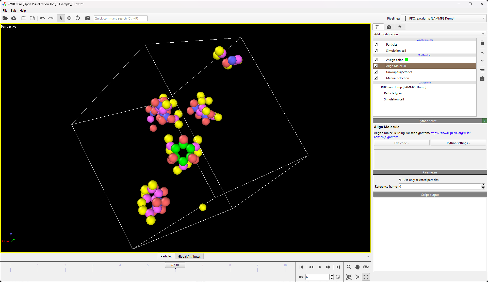

# Molecule Align
Align molecules using the [Kabsch algorithm](https://en.wikipedia.org/wiki/Kabsch_algorithm).

## Description

Aligns atoms across snapshots in a trajectory based on the [Kabsch algorithm](https://en.wikipedia.org/wiki/Kabsch_algorithm). This means that only rotation but no stretch or shear will be performed.

The algorithm can take either all atoms or a selection as atoms that are used as reference for alignment.

You may provide a reference frame. This defaults to the 0th frame. This frame is used as reference orientation for the atoms and their [centroid](https://en.wikipedia.org/wiki/Centroid) is shifted to the origin. 

### Requirements

The modifier depends on unique particle identifiers for the atoms. If non exist, they will be generated at runtime. In that case, the modifier relies on a constant order of atoms in the trajectory.

The behavior of this modifier relys on having an unwrapped trajectory. Please ensure that you provide unwrapped atomic coordinates or use the [unwrap trajectories modifier](https://www.ovito.org/docs/current/reference/pipelines/modifiers/unwrap_trajectories.html) prior to applying the molecule align modifier. For wrapped trajectories the behavior is undefined.

If the modifier onyl operates on a selection of atoms, that selection has to be consistent across the whole trajectory. The [freeze property](https://www.ovito.org/docs/current/reference/pipelines/modifiers/freeze_property.html#particles-modifiers-freeze-property) modifier can be used to keep the selection constant. Otherwise the behavior is undefined. 

### Output

The modifier outputs the root mean square deviation (RMSD) of the atomic coordinates after alignment to the reference frame. The RMSD for the selected atoms is stored in the `MoleculeAlign.RMSD` [global attribute](https://www.ovito.org/docs/current/reference/data_inspector/attributes.html). Additionally, the `MoleculeAlign.RMSD_all` value contained the RMSD for all atoms in the simulation.

It also outputs an RMSD particle property which contains the RMSD for each atom. 

Lastly, a data table with the RMSD values across the frames is generated and populated as the trajectory is viewed in OVITO. 

## Parameters 

- `only_selected` / "Use only selected particles": Use only selected particles as reference for alignment. `Default = True`
- `reference_frame` / "Reference frame": Frame number to be used as reference for alignment. `Default = 0`

## Example

Example showing the alignment of the green set of atoms over the whole trajectory.



## Installation
- OVITO Pro [integrated Python interpreter](https://docs.ovito.org/python/introduction/installation.html#ovito-pro-integrated-interpreter):
  ```
  ovitos -m pip install --user git+https://github.com/ovito-org/MoleculeAlign.git
  ``` 
  The `--user` option is recommended and [installs the package in the user's site directory](https://pip.pypa.io/en/stable/user_guide/#user-installs).

- Other Python interpreters or Conda environments:
  ```
  pip install git+https://github.com/ovito-org/MoleculeAlign.git
  ```

## Technical information / dependencies
- Tested on OVITO version 3.10.3

## Contact
Daniel Utt (utt@ovito.org)